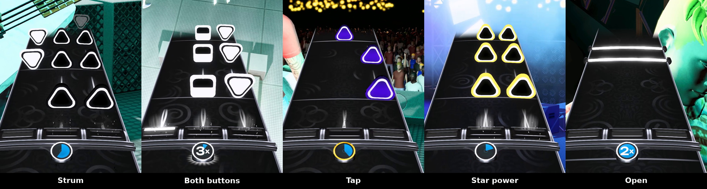
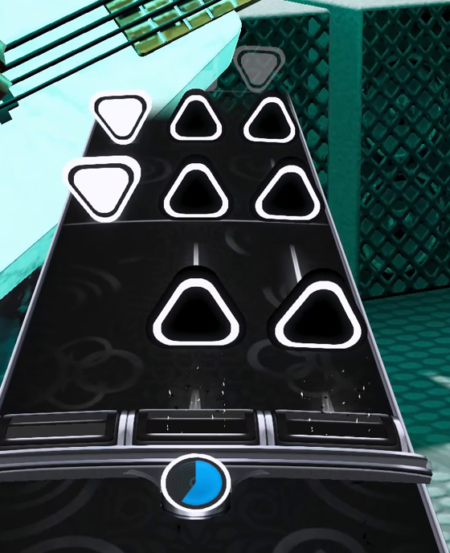
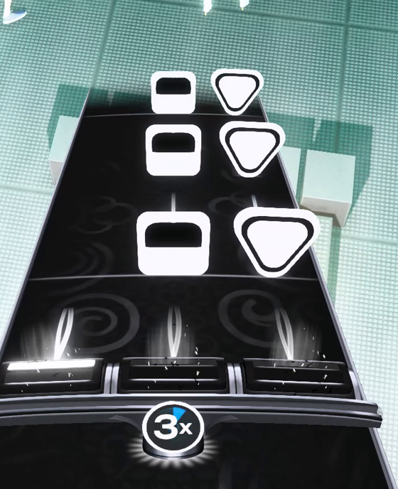
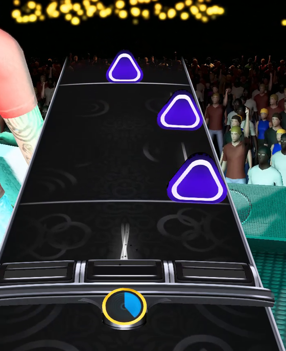
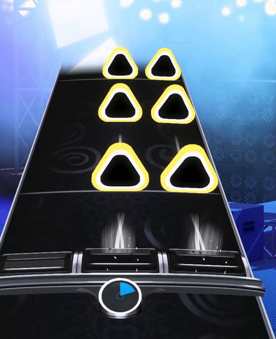
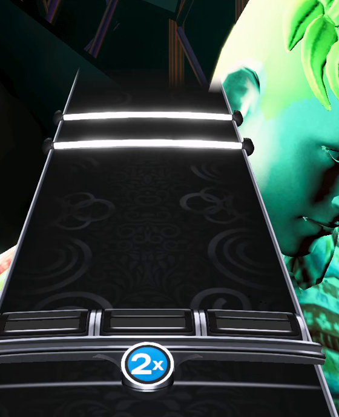

# GHL Picks — a YARG note theme

Guitar Hero Live style note art for YARG's six-fret highway: a guitar pick for the
single-button notes, pointing down for the white row and up for the black, and a
rounded square for the both-buttons note.

**This works on stock YARG.** It's an ordinary `.yargtheme`, so you don't need a
modified build.

## Install

1. Download **`GHL-Picks.yargtheme`** from
   [Releases](https://github.com/drpezzer/yarg-ghl-picks/releases). One file, every
   platform.
2. Drop it in YARG's `custom/themes` folder. Which folder depends on which build you
   run — most people are on **nightly**:
   - **Windows** — `%USERPROFILE%\AppData\LocalLow\YARC\YARG\nightly\custom\themes`
   - **Linux / Steam Deck** — `~/.config/unity3d/YARC/YARG/nightly/custom/themes`

   On a tagged **release** build, swap `nightly` for `release`.
3. Restart YARG, then pick **GHL Picks** in your profile's theme setting.

Themes are read at startup, so it won't appear until you restart.

## What it changes

Only the **six-fret notes**. Frets, highway, five-fret, drums and keys are the
stock rectangular theme, untouched — so it layers onto the normal look rather than
replacing it.

Notes are drawn in flat GHL-style tones rather than the shimmering gems the
five-fret notes use.

| | |
|---|---|
|  | **Strum notes.** A pick pointing down for the white row and up for the black, so the shape tells you which row to reach for before you've read the colour. |
|  | **Both buttons.** A rounded square when a column needs its black *and* white button held, showing both rows at once. |
|  | **Taps.** A normal note of its row with a translucent purple tint over it, following GHL's "don't strum this" convention. |
|  | **Star power.** Notes in a live star power phrase get a gold outline, and lose it the moment the phrase is broken. Taps keep their purple while gilded. |
|  | **Open notes.** The theme's standard full-width bar, unchanged, so an open strum looks the same as on every other instrument. |

HOPOs are the same shape at 85% size. They deliberately don't get the purple: a
HOPO still needs a strum when your combo is 0, so marking one never-strum would be
a lie.

One limitation worth knowing: the band inside each pick is a fixed colour rather
than following your colour profile. YARG hands a single-button note one colour, so
there's nothing to read the opposite row's colour from. Under default colours it
looks as intended; heavily recoloured profiles will leave the bands as they are.

## Source

Authored by a script rather than by hand, so the shapes can be tuned and
regenerated: `Assets/Editor/Automation/GhlPickTheme.cs` and `ThemeExporter.cs` in
[drpezzer/YARG](https://github.com/drpezzer/YARG).

## Credit

Built for [YARG](https://github.com/YARC-Official/YARG) by the YARC Official team.
Guitar Hero and Guitar Hero Live are trademarks of Activision; this is unofficial
fan work with no affiliation.
